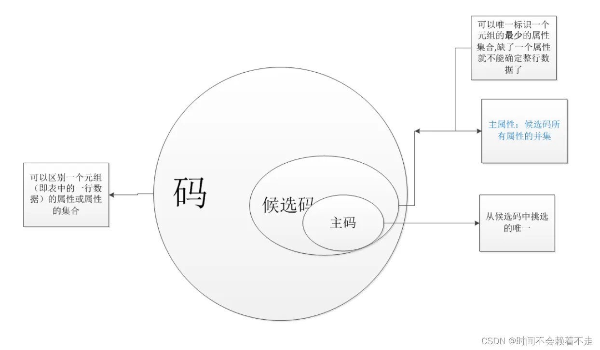
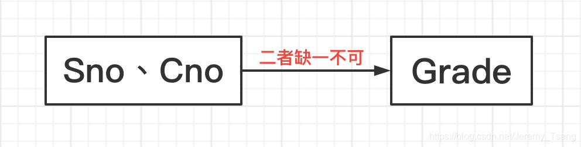
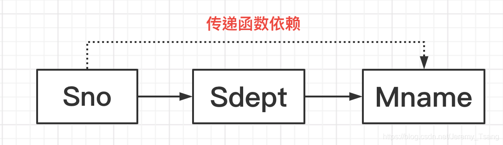

- 主属性是包含在任何一个候选码中的属性（候选码所有属性的并集），非主属性是包含在任何一个候选码中的属性。  
- 候选码：能够**唯一标识一条记录**的**最小**属性集
- 主码：某个能够唯一标识一条记录的最小属性集（从候选码**人为挑选**）
- **部分函数依赖与完全函数依赖**：关系模式S(Sno,Sname,Cno,Grade)  
完全函数依赖：如果想知道某位学生的某一门课的成绩Grade，那我必须得同时知道他的学号Sno和课程号Cno。但如果只知道一部分信息，比如他的Sno或者Cno可以吗？答案是不行的！此时称Y[Grade]完全依赖于X[Sno,Cno]。  

部分函数依赖：如果我想知道某位学生的姓名Sname，那我知道他的学号Sno就可以了。也就是说Y[Sname]只函数依赖于X[Sno,Cno]中的子集x[Sno]，此时称Y部分函数依赖于X。

- 传递函数依赖：有一个关系模式S(Sno,Sdept,Mname)，如果知道了一个学生的学号Sno，那就能知道他所在的系Sdept，如果知道了某一个系Sdept，那么就能知道这个系的系主任的姓名Mname。也就是说，我知道了一个学生的学号Sno，其实我就知道了他所在系的系主任的姓名Mname。但这个过程中，他们是不存在直接函数依赖的，我需要通过系名称Sdept作为一个桥梁去把二者联系起来的。

#### 第一范式（关系模式的最起码的要求）：  
- 定义：关系R每个属性值都是不可再分的最小单位,不含重复组。  
- 1NF应满足的条件：在关系的属性集中不存在组合属性；关系中不存在重复组。

#### 第二范式：
- 定义：在满足第1NF的基础上，每一个非主属性都完全函数依赖于R的任一候选键。  
- 2NF应满足的条件：不存在非主属性对候选键的部分函数依赖。  

#### 第三范式：
- 定义：关系R的任何一个非主属性都不传递函数依赖于它的任何一个候选键